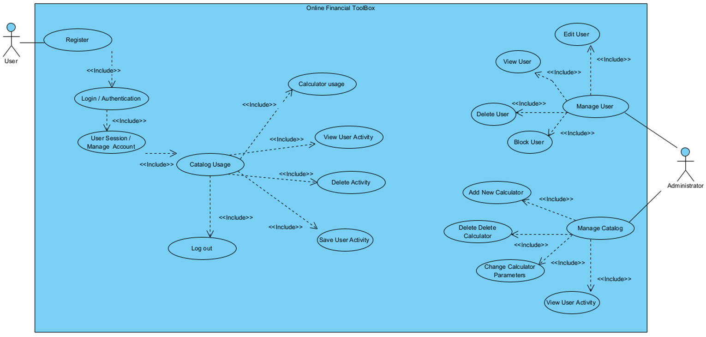
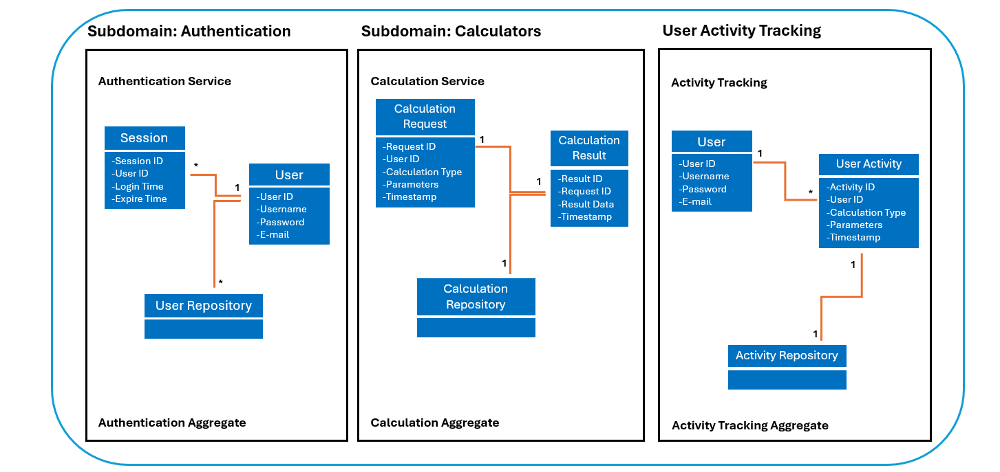

# Finance Application Documentation (FinanceTB)

[](http://www.apache.org/licenses/LICENSE-2.0.html)


#### Contents:
- [Analysis](#analysis)
    - [Scenario](#scenario)
    - [User Stories](#user-stories)
    - [Use Case](#use-case)
- [Design](#design)
    - [Prototype Design](#prototype-design)
    - [Domain Design](#domain-design)
    - [Business Logic](#business-logic)
- [Implementation](#implementation)
    - [Backend Technology](#backend-technology)
    - [Frontend Technology](#frontend-technology)
- [Project Management](#project-management)
    - [Roles](#roles)
    - [Milestones](#milestones)

## Analysis
> 🚧: You can reuse the analysis (you made) from other projects (e.g., requirement engineering), but it must be submitted according to the following template.


### Scenario

The Finance Application is designed to provide financial management tools for users, allowing them to plan for retirement, calculate mortgage payments, manage investments, track loans, and create emergency funds.

An online tool that provides you with easy, reliable and effective calculators that will support you in your daily life.

Whether you're contemplating a home purchase, investment decisions, or considering a loan, rely on Financial ToolBox to streamline your calculations, export results, and even compare them with bank or consultant estimates – all conveniently accessible in one location, and completely free!

### User Stories
1. As an Admin, I want to have a Web app to use on different mobile devices and desktop computers.
2. As an Admin, I want to see a consistent visual appearance to navigate easily, and it should look consistent.
3. As an Admin, I want to use list views to explore and read my business data.
4. As an Admin, I want to use edit and create views to maintain my business data.
5. As an Admin, I want to log-in so that I can authenticate myself.
6. As a User, I want to use list views so that I can access public pages.

### Use Case



- UC-1 [User Registration)]: User provides name, email, and password and system stores user information in the User database
- UC-2 [Calculator Usage]: User selects a specific calculator (mortgage, loan, pension etc.), and inputs parameters for the calculation 
- UC-3 [User Authentication]: User provides email and password, system verifies the credentials against the User database.
- UC-4 [View User Activity]: User can retrieve past calculations activities 

## Design
> 🚧: Keep in mind the Corporate Identity (CI); you shall decide appropriately the color schema, graphics, typography, layout, User Experience (UX), and so on.

### Wireframe
> 🚧: It is suggested to start with a wireframe. The wireframe focuses on the website structure (Sitemap planning), sketching the pages using Wireframe components (e.g., header, menu, footer) and UX. You can create a wireframe already with draw.io or similar tools.

Starting from the home page, we can visit different pages. Available public pages are visible in the menu...

### Prototype
> 🚧: A prototype can be designed using placeholder text/figures in Budibase. You don't need to connect the front-end to back-end in the early stages of the project development.

- The application features a user-friendly interface with forms for inputting financial data.
- Consistent visual appearance and navigation across different pages for ease of use.

### Domain Design
> 🚧: Provide a picture and describe your domain model; you may use Entity-Relationship Model or UML class diagram. Both can be created in Visual Paradigm - we have an academic license for it.

- Domain objects include User, Investment, Loan, Mortgage, EmergencyFund, and RetirementPlan.
- Relationships are established between entities to represent user ownership of financial data.

- The `FTbackend.finance.data.domain` package contains the following domain objects / entities including getters and setters:



### Business Logic

Based on the UC-2, there will be five types of calculation offered to the user. 

When the endpoint is accessed with the specified path and method, and the type parameter is set to "mortgage", the backend service retrieves the necessary input data required for mortgage calculations.

The service then performs various calculations based on the input data to determine key metrics such as monthly mortgage payments, total interest paid over the loan term, and the total cost of the mortgage.

Once the calculations are complete, the service returns the results in a structured format, typically in JSON, containing the calculated metrics.

**Path**: [`/api/calculators/?type="mortgage"`]

**Param**: `value="type"` Admitted value: "mortgage", "investment", "loan", "retirement", "emergencyfund".

**Method:** `GET`

## Implementation
- Backend Technology: Spring Boot, Spring Data JPA, H2 Database
  (ABDU)

### Backend Technology

This Web application is relying on [Spring Boot](https://projects.spring.io/spring-boot) and the following dependencies:

- [Spring Boot](https://projects.spring.io/spring-boot)
- [Spring Data](https://projects.spring.io/spring-data)
- [Java Persistence API (JPA)](http://www.oracle.com/technetwork/java/javaee/tech/persistence-jsp-140049.html)
- [H2 Database Engine](https://www.h2database.com)

To bootstrap the application, the [Spring Initializr](https://start.spring.io/) has been used.

Then, the following further dependencies have been added to the project `pom.xml`:

- DB:
```XML
<dependency>
			<groupId>com.h2database</groupId>
			<artifactId>h2</artifactId>
			<scope>runtime</scope>
</dependency>
```

- SWAGGER:
```XML
   <dependency>
      <groupId>org.springdoc</groupId>
      <artifactId>springdoc-openapi-starter-webmvc-ui</artifactId>
      <version>2.3.0</version>
   </dependency>
```

### Frontend Technology
> 🚧: Describe your views and what APIs is used on which view. If you don't have access to the Internet Technology class Budibase environment(https://inttech.budibase.app/), please write to Devid on MS teams.

This Web application was developed using Budibase and it is available for preview at https://inttech.budibase.app/app/pizzeria.

## Execution

1. Clone the project repository to your local machine using Git.
2. SOpen the project in your preferred Java IDE (e.g., IntelliJ IDEA, Eclipse).
3. Run the main class FinanceApplication.java located in the FTbackend.finance package. This will start the Spring Boot application.
4. Once the application is running, you can access the Swagger UI page to explore and interact with the APIs. Open a web browser and navigate to http://localhost:8080/swagger-ui.html.
5. Use the provided API endpoints to perform various calculations and operations. For example, you can calculate mortgage details by sending a GET request to /api/calculators/?type=mortgage with the appropriate parameters.
6. Perform thorough testing of the application to ensure that it meets the required functionality and performance criteria.

### Deployment to a PaaS


## Project Management
Danilo Alexandre Ribeiro da Silva presented the initial business idea and spearheaded the development efforts by creating the initial prototype using JavaScript. Throughout the project lifecycle, Danilo provided support to the team by assisting in gathering business requirements, reviewing code implementations, evaluating architectural decisions, and ensuring the completeness and accuracy of documentation.
Abdulrahman Abu Salama developed both the back and front ends of the application, leveraging his extensive coding expertise. He was responsible for coding the logic and designing the user interface.


### Roles
- Back-end and Front-end developer: Abdulrahman Abu Salama
- Business model creation, business requirements and code reviewer: Danilo Alexandre Ribeiro da Silva
- API documentation: Daniel Balzarini
- Use case, database design: Dionis Mrlaku

### Milestones
1. **Analysis**: Scenario ideation, use case analysis and user story writing.
2. **Prototype Design**: Creation of wireframe and prototype.
3. **Domain Design**: Definition of domain model.
4. **Business Logic and API Design**: Definition of business logic and API.
5. **Data and API Implementation**: Implementation of data access and business logic layers, and API.
6. **Security and Frontend Implementation**: Integration of security framework and frontend realisation.
7. (optional) **Deployment**: Deployment of Web application on cloud infrastructure.

#### Maintainer
- Abdulrahman Abu Salama

#### License
- [Apache License, Version 2.0](blob/master/LICENSE)
